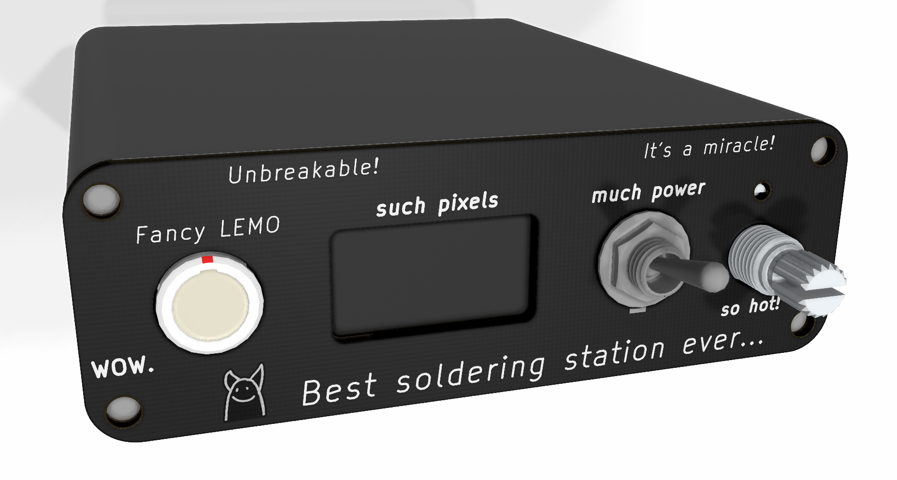

Deprecated in favor of this: https://github.com/Jan--Henrik/Otter-Iron-PRO

# JBC T210 Soldering Iron Controller

This is my first project using embedded Rust. :hugs:

Schematic: [hardware/control_board/rev2/soldering_station.pdf](hardware/control_board/rev2/soldering_station.pdf)

- Rev. 2 of the control board works fine :tada:, but I need to think of a better mechanical solution for the whole station.  

